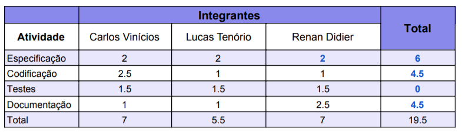

# **Projeto Grafos**

 [](https://www.python.org/)


## **Índice:**  

[Intro](#Intro)  
[Como rodar a API?](#Como-rodar-a-API?)  
[Estrutura do código](#Estrutura-do-código)  
[Classes](#Classes)  

- [Classe Graph](#Classe-Graph)  
- [Classes Vertice e Edge](#Classes-Vertice-e-Edge) 

[Métodos](#Métodos)  
- [Métodos da classe Graph](#Métodos-da-classe-Graph)  
- [Métodos da classe Vertice](#Métodos-da-classe-Vertice)  
- [Métodos da classe Edge](#Métodos-da-classe-Edge)  


[Algotitmo de Dijkstra](#Algotitmo-de-Dijkstra)  
- [Como Funciona e complexidade Temporal](#Como-Funciona)  
- [Pseudocódigo](#Pseudocódigo)  
- [Executando o algoritmo](#Como-executar)  


[Banco de horas](#Banco-de-horas)  
 


# **Intro**

Projeto desenvolvido em Python com o objetivo de entregar uma API capaz de criar, modificar e analisar grafos. Durante a primeira etapa do projeto foi realizada a estrutura base da aplicação, com a possibilidade de criação, manipulação e visualização dos valores em um grafos. Para a segunda fase desenvolvemos um algoritmo de Dijkstra para encontrar o menor caminho entre os vértices de um grafo.

## **Como rodar a API?**
- Entre na pasta code dentro do repositório
- Execute no terminal python3 main.py
- Execute o comando `help` para mais informações


# Estrutura do código  

O código foi estruturado de uma forma que tivesse uma alta escalabilidade para futuras implementações. Com isso em mente foi escolhido adotar uma estratégia de programação orientada a objetos para que fosse possível dividir a estrutura do código de maneira mais acoplável para novas classes. Atualmente a API conta com as seguintes classes:  

## **Classes**

O código pode ser divido entre as seguintes classes:

### **Classe Graph** 

Todo o projeto é instanciado ela, onde são feitas as adições das demais classes. Fica resposável pelas seguintes atividades:  
* Criar os Vértices;
* Criar as Arestas;
* Retornar a ordem do grafo;
* Retornar o tamanho do grafo;
* Retornar os valores dos vértices;
* Retornar o grafo.

### **Classes Vertice e Edge**

Após instaciada a classe Graph é possível dar um nome para os vértices e arestas, para isso, é criado primeiro um objeto Vertice, o qual é responsável pela atribuição de valores para o vertice, incluindo a criação dos objetos Edge, que guardam os valores referentes a uma aresta do grafo.


## **Métodos**

### **Métodos da classe Graph**  

- **get_graph_vertices( ):**
    - **Parâmetros:**  
        - nenhum;
    
    - **Descrição:** Retorna uma lista de todos os vertices pertencentes ao grafo.

- **is_vertices_adjacents(Vertice vertice_one, Vertice vertice_two):**
    - **Parâmetros:**  
        - vertice_one: Primeiro vertice da comparação;  
        - vertice_two: Segundo vertice da comparação;

    - **Descrição:** Retorna verdadeiro caso os vértices sejam adjacentes e falso contrário.

- **get_vertice_edges(string vertice_name, string direction='output'):**
    - **Parâmetros:**  
        - vertice_name: Nome do vértice desejado;
        - direction: Caso queira saber se o vértice possui arestas de chegada e/ou de saida em um grafo direcionado. Por default o valor é 'output', que retorna os vértices de saída;

    - **Descrição:** Retorna uma lista de tuplas contendo as arestas que conectam aquele vertice com outros

- **get_n_vertices_by_name(string vertice_name, string direction='output'):**
    - **Parâmetros:**  
        - vertice_name: Nome do vértice desejado;
        - direction: Caso queira saber se o vértice possui arestas de chegada e/ou de saida em um grafo direcionado. Por default o valor é 'output', que retorna os vértices de saída;
    - **Descrição:** Retorna o tamanho das arestas que conectam aquele vertice com outros.

- **create_vertice(vertice_name, conection_list=[], edges_values:list = []):**
    - **Parâmetros:**  
        - vertice_name: Nome que vai ser atribuído ao vértice;
        - conection_list: Lista de vértices que vão ser conectados ao vértice;
        - edges_values: se o vertice possuira um nome em especifico.
    - **Descrição:** Cria um vértice.

- **get_graph_order():**
    - **Parâmetros:**  
        - nenhum
   - **Descrição:** Retorna o ordem do grafo

- **get_vertice_value_by_name(string vertice_name)**
    - **Parâmetros:**  
        - vertice_name: Nome do vertice que será buscado.
    - **Descrição:** Retorna o valor do vértice.

- **get_graph_size()**
    - **Parâmetros:**  
        - Nenhum
    - **Descrição:** Retorna o tamanho do grafo.

- **get_graph():**
    - **Parâmetros:**  
        - nenhum
    - **Descrição:** Retorna o grafo completo.

- **delete_vertice_by_name(string vertice_name):**
    - **Parâmetros:**  
        - vertice_name: nome do vértice.
    - **Descrição:** Exclui o vértice e suas conexões do grafo.

- **set_edge_value_by_edge(tuple edge_tuple, new_value):**
    - **Parâmetros:**  
        - edge_tuple: Tupla que contém os dois vértices que definem a aresta;
        - new_value: Valor para a aresta.
    - **Descrição:** Define um novo valor para a aresta.

- **get_edge_value_by_edge(tuple edge_tuple):**
    - **Parâmetros:**  
        - edge_tuple: Tupla que contém os dois vertices que definem a aresta.
    - **Descrição:** Retorna o valor da aresta.  

- **distance_dj(string start, string end=None):**
    - **Parâmetros:**  
        - start: Nome do vértice de origem.  
        - end: Nome do vértice de destino.  
    - **Descrição:** Retorna o valor da manor distância entre os dois vértices.  


### **Métodos da classe Vertice**
- **get_name():**
    - **Parâmetros:**  
        - nenhum
    - **Descrição:** Retorna o vértice.

- **get_vertice_conections():**
    - **Parâmetros:**  
        - nenhum
    - **Descrição:** Retorna as arestas relacionadas ao vertice.

- **get_vertice_value():**
    - **Parâmetros:**  
        - nenhum
    - **Descrição:** Retorna o valor atribuido ao vértice.

- **update_value(, new_value)**
    - **Parâmetros:**  
        - new_value: Novo valor para o vértice.
    - **Descrição:** Define um novo valor para o vértice.

- **set_edge_value_by_edge(tuple edge_tuple, new_value):**
    - **Parâmetros:**  
        - edge_tuple: Tupla que contém os dois vertices que definem uma aresta;
        - new_value: Novo valor da aresta.

    - **Descrição:** Define o novo valor para a aresta.

- **get_edge_value_by_edge(tuple edge_tuple)**
    - **Parâmetros:**  
        - edge_tuple: Tupla que contém os dois vértices.
    - **Descrição:** Retorna o valor da aresta.


### **Métodos da classe Edge**  

- **get_edge():**
    - **Parâmetros:**  
        - Nenhum

    - **Descrição:** retorna a aresta

- **get_edge_value():**
    - **Parâmetros:**  
        - nenhum

    - **Descrição:** Retorna o valor da aresta.

- **set_edge_value(value):**
    - **Parâmetros:**  
        - value: valor que vai ser atribuido a aresta
    
    - **Descrição:** Define um novo valor para a aresta.


# **Algotitmo de Dijkstra**  

Algoritmo criado como solução para o problema do menor caminho, calculando a menor distância de um ponto para todos os outros existentes no grafo.  

## Como Funciona

O algoritmo de Dijkstra identifica, a partir de um nó O, qual é o custo mínimo entre esse nó e todos os outros do grafo. No início, o conjunto S contém somente esse nó. A cada passo, selecionamos no conjunto de nós sobrando, o que está mais perto da origem. Depois atualizamos, para cada nó que está sobrando, a sua distância em relação à origem. Se passando pelo novo nó acrescentado, a distância ficar menor, é essa nova distância que será memorizada (O calculo da distancia é feito somando o valor do nó + o valor da aresta).  
Escolhido um nó como origem da busca, este algoritmo calcula, então, o custo mínimo
deste nó para todos os demais nós do grafo. O procedimento é iterativo,
determinando, na iteração 1, o nó mais próximo do nó O, na segunda iteração, o
segundo nó mais próximo do nó O, e assim sucessivamente, até que em alguma
iteração todos os n sós sejam atingidos.  
A sua complexidade temporal varia de acordo com a implementação, porém é concenso geral que em média é de **O(V2)**, onde V é o numero de vértices no grafo.  

## Pseudocódigo  

```python
lista_ordem = []
lista_ordem.append(vertice de origem)
Vértice_de_origem = 0

while(lista_ordem != []):
	actual_vert = lista_ordem[0]

	Vertices_conectados = lista com os vertices conectados ao vertice atual;

	while(Vertices_conectados):

		val_vert = valor do vértice atual
		targeted_vert_val = valor do vértice desejado
		edge_val = distância para novo vértice
		targeted_vert = nome do vertice desejado
		lista_ordem.append(targeted_vert)

		if(val_vert + edge_val < targeted_vert_val  or targeted_vert_val  == None):
			targeted_vert_val = val_vert + edge_val

	lista_ordem.pop(0) #remover primeiro elemento da lista para não entrar em loop infinito; 
```  


## **Como executar**  

Na prática, escrevemos na shell que foi criada no projeto para:  
* Executar o comando 'help' para ver lista de comandos;
* Criar um grafo;
* Executar o algoritmo de Dijskra.  <br></br>


  


# **Banco de horas**  

Para o desenvolvimento da segunda atividade foi criada uma nova planilha com as horas de cada contribuidor em cada atividade. No final do projeto a tabela ficou da seguinte forma:  <br></br>

